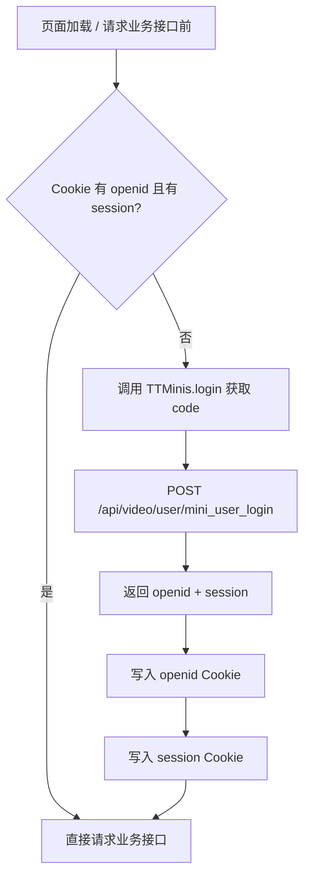

# 登录鉴权文档（openid + session）

本文档定义当前 H5 页面初始化和业务接口请求前的登录态处理规则。

## 1. 当前规则

1. 页面加载后，先检查 Cookie 里的 `openid` 和 `session`。
2. 业务接口请求前，也会再次检查 `openid` 和 `session`。
3. 只要缺少任意一个，就调用 TikTok Minis SDK 登录：
   - `window.TTMinis.login` 获取 `code`
   - 请求 `/api/video/user/mini_user_login`
   - 接口直接返回 `openid` 和 `session`
   - 前端把 `openid` 和 `session` 都写入 Cookie
4. 如果 `openid` 和 `session` 都存在，直接发起业务接口请求。

## 2. 当前登录链路



## 3. 接口说明

### 3.1 `/api/video/user/mini_user_login`

- 用途：当前实际登录接口
- 调用时机：
  - 页面初始化时发现 `openid/session` 缺失
  - 业务接口请求前发现 `openid/session` 缺失
  - 服务端返回登录失效码后重新登录
- 请求参数：

```json
{
  "code": "tt_login_code_xxx"
}
```

- 返回字段：
  - `openid`
  - `session`

### 3.2 `/api/video/store/reportTiktokCode`

- 用途：拿 `code` 去刷新 `access_token`
- 当前状态：当前登录态初始化流程里**不使用**
- 预期使用场景：后续支付相关接口调用前再接入

## 4. Cookie 约定

- `openid`: 长期有效
- `session`: 长期有效
- `uid`: 跟随 `openid` 同步写入，供请求头签名使用
- `devId`: 首次生成后持久化，供请求头签名使用

建议属性：

- `path=/`
- `SameSite=Lax`
- `Secure`（HTTPS 环境）

说明：浏览器没有真正永久 Cookie，当前以前端长 `Max-Age` 的方式实现长期有效。

## 5. 前端伪代码

```ts
async function ensureLogin() {
  const openid = getCookie('openid')
  const session = getCookie('session')

  if (openid && session) {
    return
  }

  const code = await new Promise<string>((resolve, reject) => {
    window.TTMinis.login((res: { authResponse?: { code?: string } }) => {
      const loginCode = res?.authResponse?.code
      if (!loginCode) {
        reject(new Error('TTMinis.login 未返回 code'))
        return
      }
      resolve(loginCode)
    })
  })

  const loginRes = await request.post('/api/video/user/mini_user_login', {
    code,
  })

  setCookie('openid', loginRes.openid)
  setCookie('session', loginRes.session)
  setCookie('uid', loginRes.openid)
}
```

## 6. 异常处理建议

- `TTMinis.login` 无 `code`：提示“登录初始化失败，请稍后重试”
- `mini_user_login` 失败：清理当前 `openid/session`，下次请求前重走登录流程
- `reportTiktokCode`：当前不参与页面初始化登录，不影响现有业务接口访问
